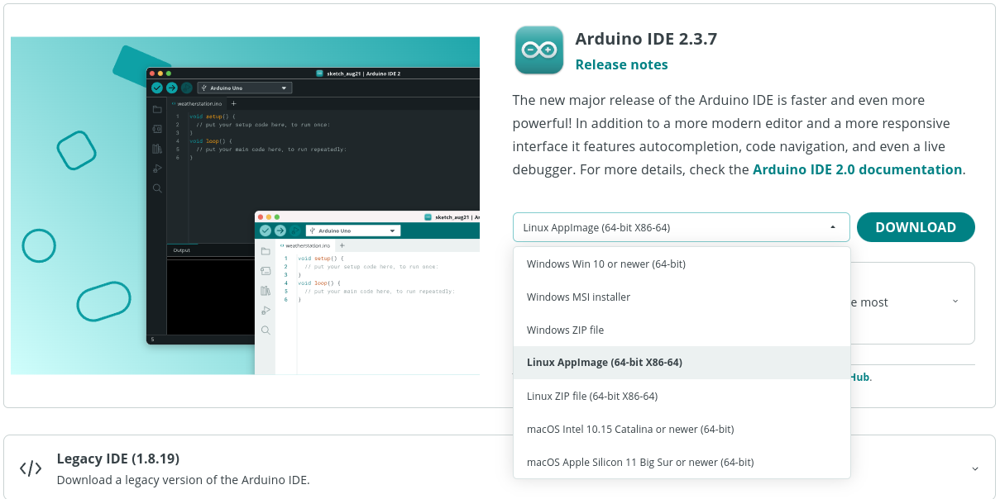
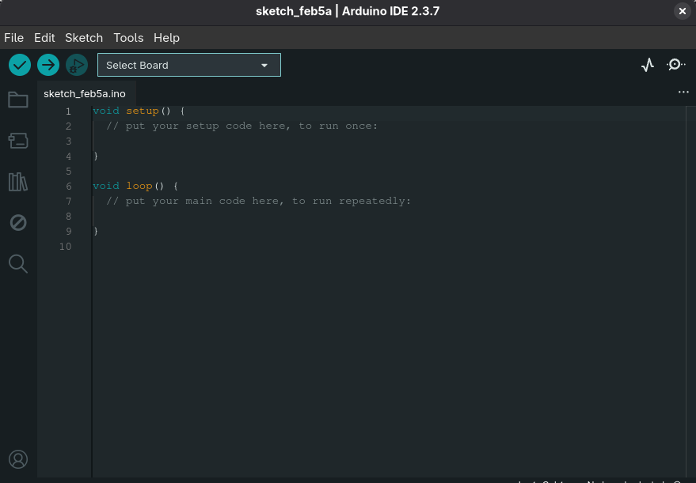
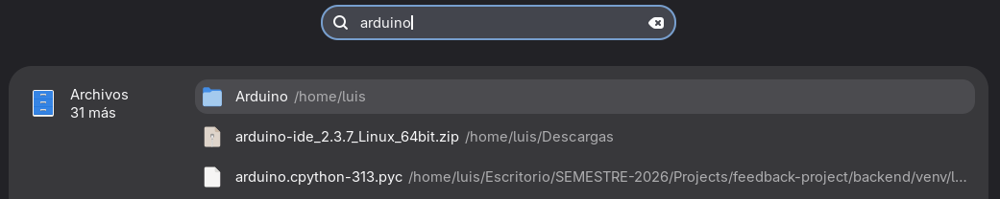
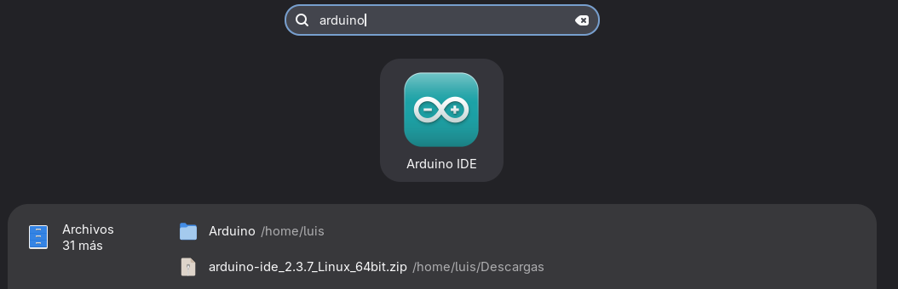
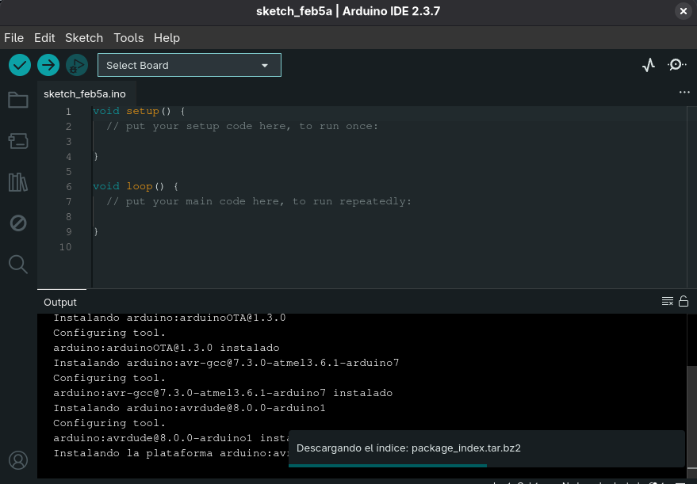

# Guía para instalar Arduino IDE en Linux
## Visitar el sitio oficial

El sitio oficial para descargar las versiones de Arduino IDE es: https://www.arduino.cc/en/software/

Hay dos formas de instalar y utilizar Arduino IDE en Linux, la primera es utilizando la **Linux AppImage** y la segunda forma es descargando el archivo comprimido **Linux ZIP file**, en esta guía verán como realizarlo utilizando las dos formas. 



## Linux ZIP File
Este es un archivo comprimido, contiene todo lo necesario, carpetas y archivos. Se descomprime de de forma manual y se ejecuta desde un binario. 

1. Descargar el archivo comprimido, ls para listarlo en la carpeta Descargas.
```bash
luis  ~/Descargas  ls arduino-ide_2.3.7_Linux_64bit.zip 
arduino-ide_2.3.7_Linux_64bit.zip
```

2. Descomprimir el archivo
```bash
luis  ~/Descargas  unzip arduino-ide_2.3.7_Linux_64bit.zip

# Esto genera una carpeta, se puede listar para visualizarla
luis  ~/Descargas  ls -d arduino-ide_*

# Esta es la carpeta             Este es el zip descargado
arduino-ide_2.3.7_Linux_64bit  arduino-ide_2.3.7_Linux_64bit.zip
```

3. Mover la carpeta, por ejemplo a Aplicaciones, ya que es un lugar fijo.

```bash
# Actualmente no hay nada sobre arduino en esta ruta
luis  ~/Applications  ls
Bitwarden-2025.12.1.AppImage  

# Desde la carpeta Descargas se mueve el archivo
 luis  ~/Descargas  mv arduino-ide_2.3.7_Linux_64bit/ ~/Applications/
renamed 'arduino-ide_2.3.7_Linux_64bit/' -> '/home/luis/Applications/arduino-ide_2.3.7_Linux_64bit'

# Verificar si se movió correctamente
luis  ~/Descargas  cd ~/Applications/
 luis  ~/Applications  ls
# Aquí está la carpeta
arduino-ide_2.3.7_Linux_64bit  Bitwarden-2025.12.1.AppImage
```

4. Ejecutar el archivo binario
```bash
 # Ingresar a la carpeta
 luis  ~/Applications  cd arduino-ide_2.3.7_Linux_64bit/

# Listar los archivos
luis  ~/Applications/arduino-ide_2.3.7_Linux_64bit  ls
arduino-ide             chrome_crashpad_handler


# Ejecutar
luis  ~/Applications/arduino-ide_2.3.7_Linux_64bit  ./arduino-ide 

# Inicia la ejecución
Arduino IDE 2.3.7
Checking for frontend application configuration customizations
```


### Extra
Pueden agregar el ejecutable al lanzador de aplicaciones para evitar ingresar a la ruta y solo darle click al icono de Arduino IDE. 

Actualmente no se encuentra: 
)

1. Crear el .desktop, en esta ruta share/applications, se encuentran otros lanzadores agregados manualmente
```bash
luis  ~  cd ~/.local/share/applications/
 luis  ~/.local/share/applications  ls
 appimagekit-Bitwarden.desktop   mimeinfo.cache

# Crear el .desktop, nano se utiliza para editar este archivo a crear
nano ~/.local/share/applications/arduino-ide.desktop
```

2. Editar el archivo, al realizar el paso 1 se abrirá el editor nano, agregar la siguiente información, tomando en cuenta que Applications puede cambiar a Aplicaciones según como esté su propia distribución. 

```bash
[Desktop Entry]
Name=Arduino IDE
Comment=Entorno de desarrollo para Arduino
Exec=/home/luis/Applications/arduino-ide_2.3.7_Linux_64bit/arduino-ide
Icon=/home/luis/Applications/arduino-ide_2.3.7_Linux_64bit/arduino-ide_2.3.7_Linux_64bit/resources/app/resources/icons/512x512.png
Terminal=false
Type=Application
Categories=Development;IDE;
```

Al terminar de editar, se guardan los cambios con Ctrl+O, Enter para confirmar la ruta y nombre, Ctrl+X para salir. 

Si quieren ver el contenido del archivo creado pueden usar el comando **cat arduino-ide.desktop**.

3. Buscar el archivo en las aplicaciones de su distribución, darle click y ya lo pueden utilizar.



## AppImage 
La AppImage no es un instalador, es un ejecutable, esto facilita el uso, es ideal para evitar conflicots si se quiere manejar diferentes versiones de Arduino IDE. 

Solo se necesita descargar el archivo y dar permisos de ejecución. 

**NOTA: Para entender los permisos en Linux se recomienda** https://www.icm.es/2021/12/12/conocer-los-permisos-de-tus-ficheros-en-linux/

1. Descargar el archivo, ls para listarlo en la carpeta Descargas.
```bash
 luis  ~/Descargas  ls arduino-ide_2.3.7_Linux_64bit.AppImage 

# Este es el archivo descargado
arduino-ide_2.3.7_Linux_64bit.AppImage
```

2. Dar permisos de ejecución
```bash
chmod +x arduino-ide_2.3.7_Linux_64bit.AppImage
```

3. Ejecutar el programa
```bash
luis  ~/Descargas  ./arduino-ide_2.3.7_Linux_64bit.AppImage 
Warning: Ignoring XDG_SESSION_TYPE=wayland on Gnome. Use QT_QPA_PLATFORM=wayland to run on Wayland anyway.
License accepted
Arduino IDE 2.3.7
```

4. Utilizar el software


Si el AppImage es eliminado, también se elimina Arduino IDE ya que este ejecutable no toca el sistema.

**Desinstalar**
```bash
luis  ~/Descargas  ls arduino-ide_2.3.7_Linux_64bit.AppImage 
arduino-ide_2.3.7_Linux_64bit.AppImage

 luis  ~/Descargas  rm arduino-ide_2.3.7_Linux_64bit.AppImage 
 
 luis  ~/Descargas  ls arduino-ide_2.3.7_Linux_64bit.AppImage 
ls: no se puede acceder a 'arduino-ide_2.3.7_Linux_64bit.AppImage': No existe el fichero o el directorio
```

